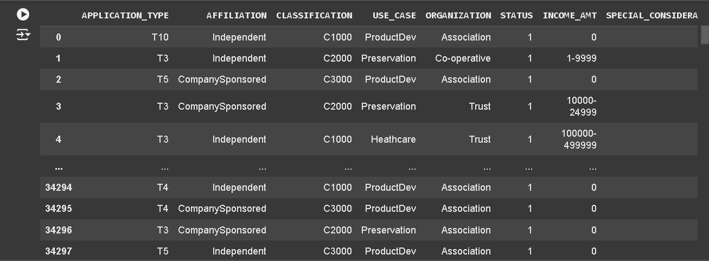

** Analysis Report**

For this part of the assignment, you’ll write a report on the performance of the deep learning model you created for Alphabet Soup.

The report should contain the following:

Overview of the analysis: Explain the purpose of this analysis.

Results: Using bulleted lists and images to support your answers, address the following questions:

*Data Preprocessing*

1.  What variable(s) are the target(s) for your model?
- The target variable is the 'IS_SUCCESSFUL' column from application_df
2.  What variable(s) are the features for your model?
- The feature variables are every other column from application_df --> this was defined by dropping the 'IS_SUCCESSFUL' column from the original dataframe

3.  What variable(s) should be removed from the input data because they are neither targets nor features?
- Both 'EIN' and 'NAME' columns were dropped/removed, because they were neither targets nor features for the dataset.

*Compiling, Training, and Evaluating the Model*

1.  How many neurons, layers, and activation functions did you select for your neural network model, and why?
- In the first attempt, i used 8 hidden_nodes_layer1 and 5 hidden_nodes_layer2 -- these were assumptions and try other for second and thid attempt.

2.  Were you able to achieve the target model performance?
- I was not able to achieve the 75% model accuracy target

3.  What steps did you take in your attempts to increase model performance?
- I added more layers like hidden layers, removed more columns, added additional hidden nodes, and switched up the activation functions associated with each layer in an attempt to achieve higher model accuracy. 

*Summary*
Summarize the overall results of the deep learning model. Include a recommendation for how a different model could solve this classification problem, and then explain your recommendation.

Overall, the deep learning model was around 73% accurate in predicting the classification problem. Using a model with greater correlation between input and output would likely result in higher prediction accuracy. This could be achieved by doing additional data cleanup up front, as well as by using a model with different activation functions and iterating until higher accuracy is reached. 